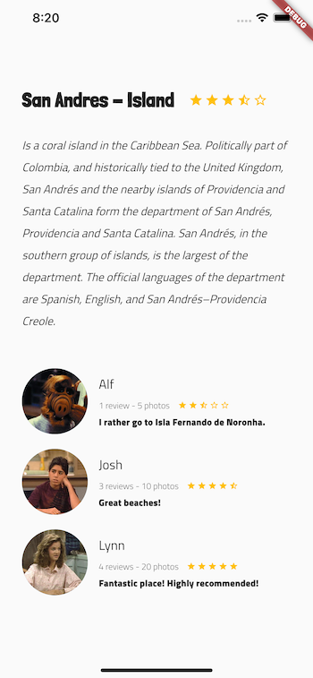
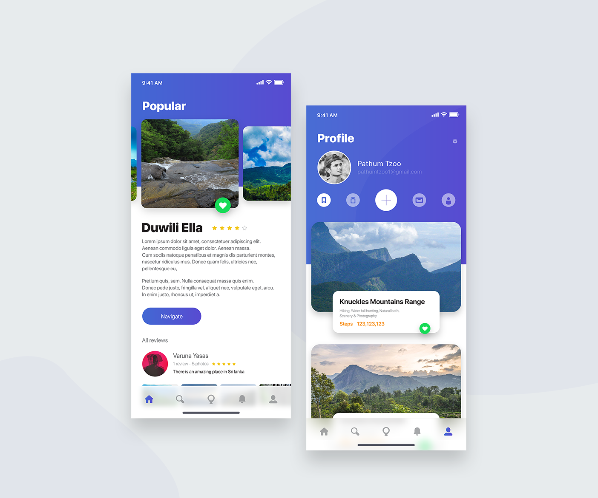

# Trips App
A Trips application using Flutter.

## What is this about?

This is my first beautifully styled Flutter app , which shows static data of a Trips app. 

My aim with this project is to get the fundamentals of a well structured and styled application using Flutter and Dart, in order to apply the skills on two College's projects I'm working on.

## Technologies
This project is fully made with:
* [Flutter](https://flutter.dev/)
* [Dart](https://dart.dev/)

No specific Android/iOS code was touched.

## Current status
This app is under development. 
Screenshots will be added on each big update, showing the corresponding current status.

## Expected final status
The following image shows the design base of this project. This is the objective I'm aiming to achieve when completing the course. 

This beautiful design was made by [Plathum Tzoo](https://www.uplabs.com/pathumtzoo) and can be found in [Uplabs](https://www.uplabs.com/posts/ui7-kit)

## Sources
This app is based on the [Flutter's Course from Platzi](https://platzi.com/clases/flutter/).
Based design can be found in [Uplabs](https://www.uplabs.com/posts/ui7-kit)
